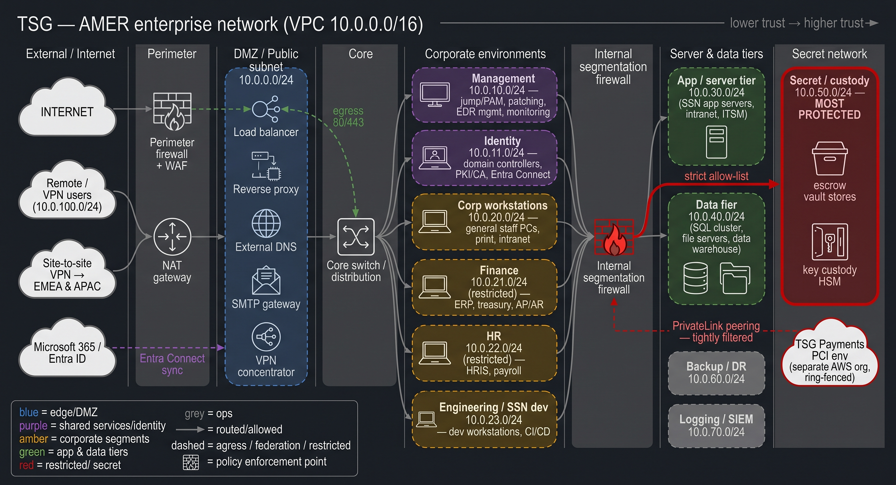
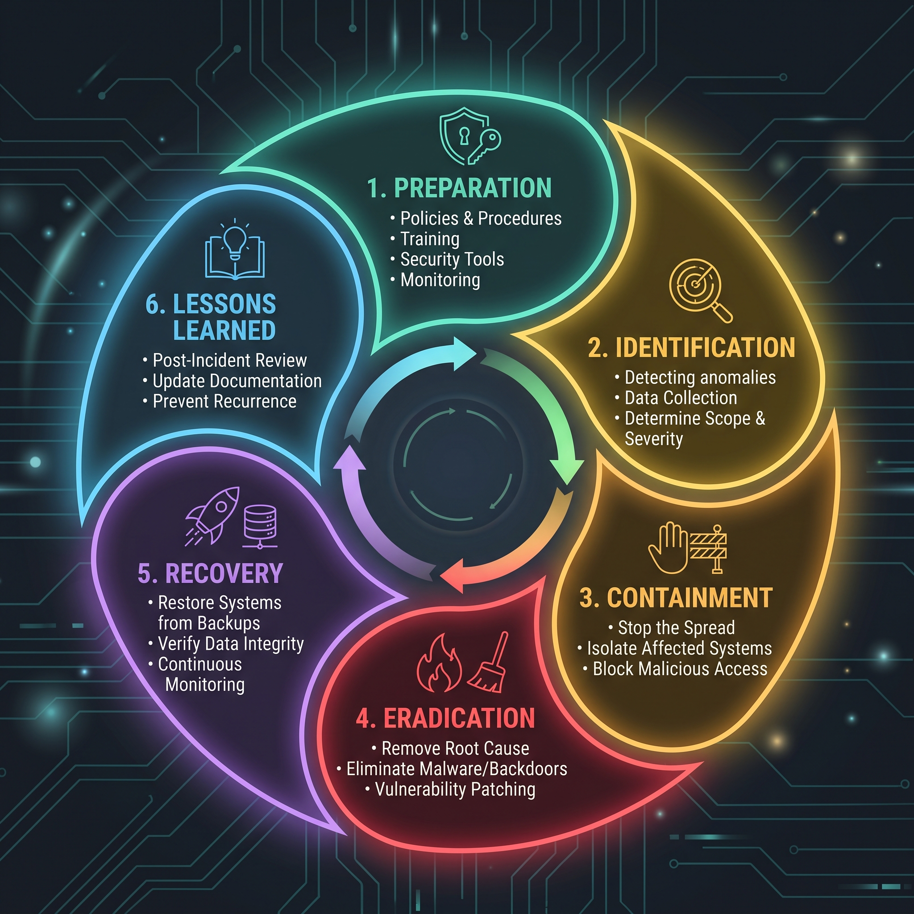
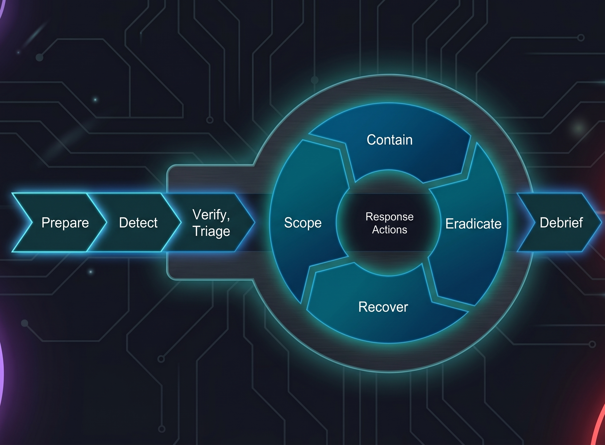
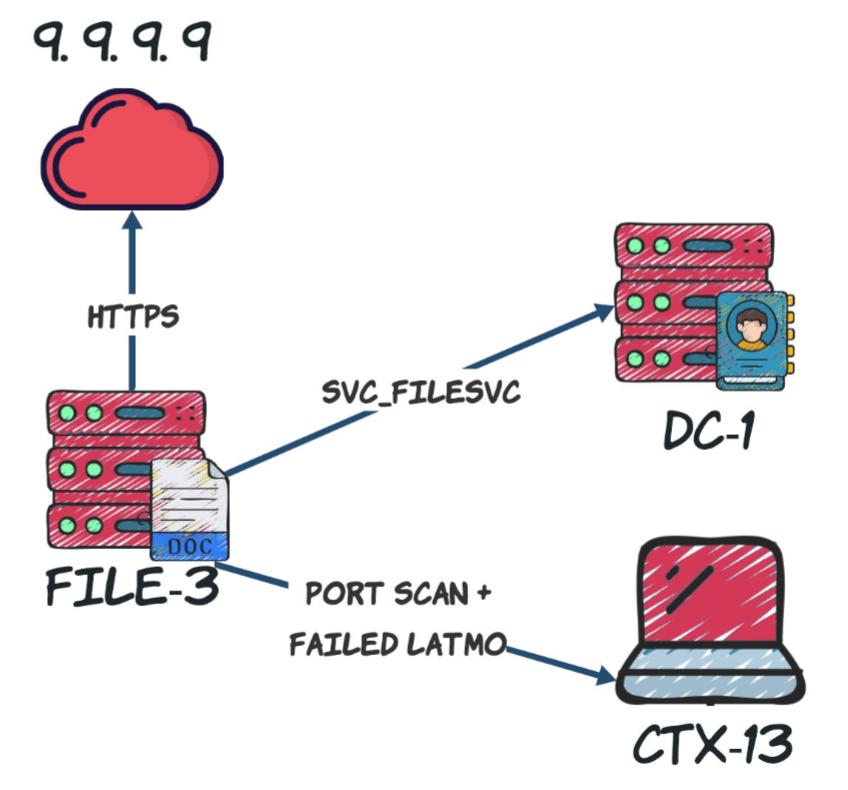

<!--
Converted from QU-Talk.pptx into the lpearson-terminal theme.
The source is a reusable talk template, so the agenda, section, bullet,
comparison and diagram slides keep their placeholder text for you to fill
per talk. The title, whoami and contact slides use your real details.
The source had duplicate title/whoami template slides; collapsed to one each.
Render: marp qu-talk.md --theme ./lpearson-terminal.css -o qu-talk.pdf
-->

<!-- _class: lead -->
<!-- _paginate: false -->

> $ ./talk --start

# **Case Study: Intrusion Response**

## Living through the fun together

Luke Pearson · lpearson.co · QU 2026

---

<!-- _class: lead -->

> $ whoami

# Luke Pearson

## Incident Response · Digital Forensics · Expert Witness

- 8 years of incident response, 60+ intrusions worked
- GSE #358 · CCE · 20+ GIAC · Master of Cyber Security
- SANS instructor · PhD candidate

---

# Agenda

1. Intrusion Response Theory
2. Hired by The Secrets Group
3. An intrusion! Who could have seen this coming?!
4. Doing the fun technical stuff
5. Doing the ~~fun~~ business stuff
6. Wrapping up / QnA

---

# What's an Incident?

```console
> cat definition_of_incident.NIST_SP_800-61R2
a violation or imminent threat of violation of computer security policies, 
acceptable use policies, or standard security practices.

> cat definition_of_incident.SALESFORCE
a confirmed breach of security that leads to the accidental or unlawful destruction, 
loss, alteration, unauthorized disclosure of, or access to customer data or personal 
data while Microsoft processes it.

> cat definition_of_incident.BHP
any actual or potential accidental, unauthorised or unlawful destruction, loss, 
alteration, or unauthorised third-party access to or disclosure of Company Data.

```

---

# What's an Intrusion?

```console
> cat definition_of_INTRUSION

the interactive access to more than one computing system by an attacker, where the 
access to subsequent systems is dependent on the compromise of previous systems.

For example, two different systems being compromised by the same phishing campaign
would not meet this criteria, but the compromise of one system leading to lateral
movement to a second system would.

># OH! It's the FUN stuff!

```

---

# The Secrets Group (TSG)

### TSG: **Trust us, not Luck**

Founded in Wellington in 2012 as a boutique source-code escrow agent, The Secrets Group has grown into a global custody business spanning 35 jurisdictions and around 6,800 people. From software escrow and key custody for banks and governments, to physical safe-deposit vaults, digital-asset custody, and secure storefronts on the high street, we hold what our clients cannot afford to lose, and hand it back only when it's needed.

**Our mission** is simple: be the safest place in the world to leave a secret. Everything we build, from the SSN platform to the vault door, exists to keep custody of sensitive material verifiable, recoverable, and private.

---



---

<!-- _class: two-up -->
 

---

# The Bleeding-Edge

 

- Dynamic Approach to Incident Response (DAIR)
- Brings the SOC to the table
- Still doesn't mention Investigate, but Scope is closer

---

# The Detection

 

- Detection fired for anomalous activity for the svc_filesvc account from FILE3​
- Consistent short-lived network connections to 9.9.9.9.​
- WinRM and SMB connections to DC1​
- All activity came from the process associated with image C:\Windows\Temp\WDUpdate.exe​
- WDUpdate.exe is a child process of services.exe​

---

# Comparison heading

| Pros | Cons |
|------|------|
| Advantage one | Trade-off one |
| Advantage two | Trade-off two |
| Advantage three | Trade-off three |
| Advantage four | Trade-off four |

---

# Flow / diagram heading

```text
  Component A  -->  Component B  -->  Component C
```

Caption describing what the diagram shows, in one line.

---

<!-- _class: end -->
<!-- _paginate: false -->

# Thank you.

Questions?

`hello@lpearson.co` · `lpearson.co` · `linkedin.com/in/luke-pearson-infosec`
